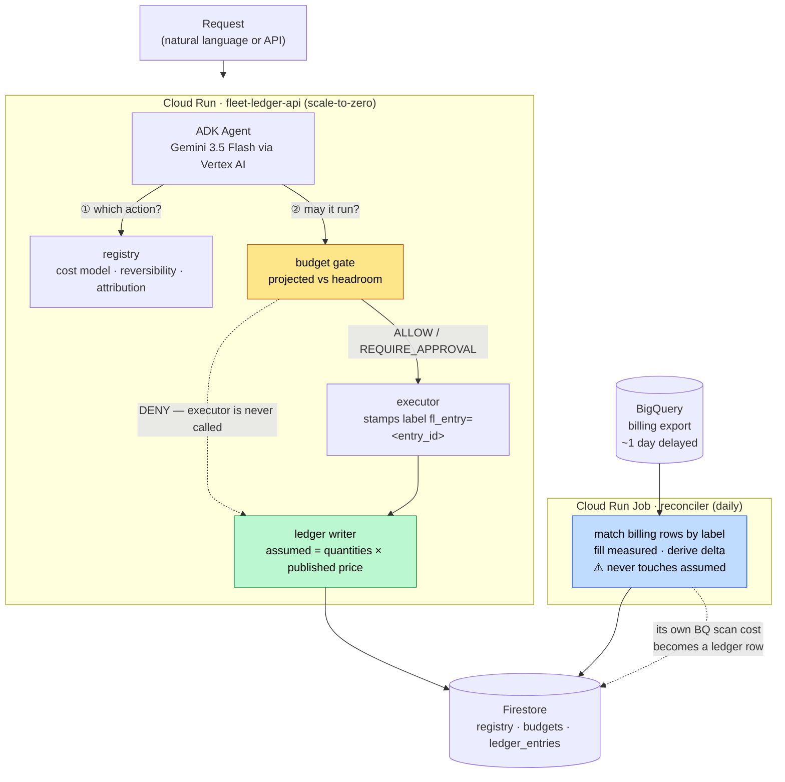
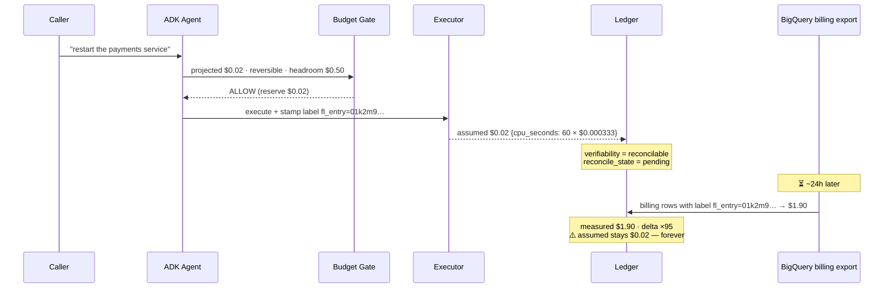
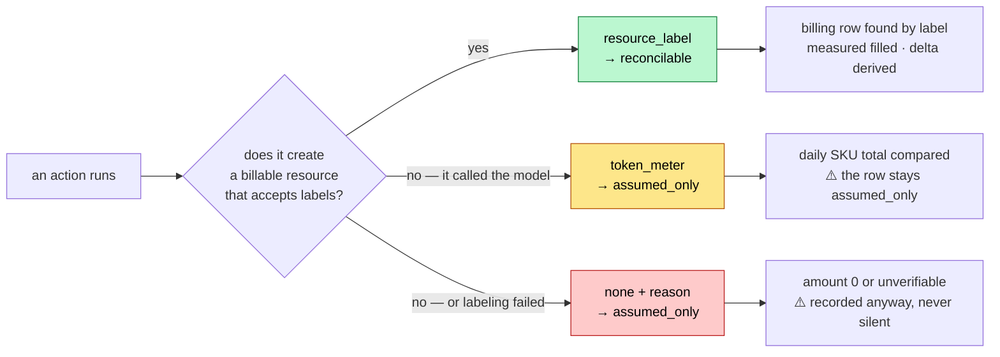
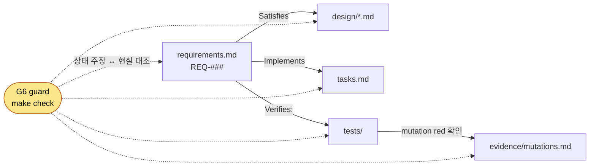

# fleet-ledger — 개요

> **에이전트 함대의 장부 — 행동에 클라우드 지출을 귀속한다.**
>
> Google All Things Agentic Hackathon · Fortified Enterprise Fleet 트랙
> 작성 2026-08-19 · 상태: **설계 완료 · 구현 진행 중**

이 문서는 **사람이 읽는 진입점**이다. "무엇을·왜·어떻게"를 답한다.
**요구사항의 권위는 [`specs/fleet-ledger/requirements.md`](../specs/fleet-ledger/requirements.md)**,
**결정 근거의 권위는 [`design.md`](../specs/fleet-ledger/design.md)**다. 이 문서는 **그림과 서사**를 소유한다.

---

## 1. 무엇을 하는 프로젝트인가

에이전트가 클라우드에서 **행동 하나를 할 때마다 장부에 한 줄을 쓴다.** 그 줄에는
**우리가 추정한 비용**과, 하루 뒤 청구서가 도착하면 **실제로 나온 비용**이 **나란히** 남는다.
추정은 절대 덮어쓰지 않는다.

**그 둘의 차이가 이 시스템의 산출물이다.**

## 2. 왜 — 문제는 측정된 것이다

에이전트 관측(observability)은 **토큰·지연·오류**를 본다.
**에이전트가 쓴 돈**은 안 본다. 그리고 그 돈의 *추정*은 안심시키는 쪽으로 체계적으로 틀린다.

| | 추정 | 실측 | 배율 |
|---|---|---|---|
| 모니터링 파이프라인 시계열 수 | "랩 규모 **수백**" | **52,438** | **약 100배** |
| 월 비용 | $2–7 | ≈$180+ | 약 100배 |

**정가는 맞았다. 틀린 것은 수량 가정이었다.** 그리고 그 클러스터는 이미 저사양으로 깎여
있었다 — 즉 헤프게 설정해서가 아니라 **그 스택의 정상값**이었다.

⚠️ 더 나쁜 것: **GCP는 실지출을 읽는 API가 없다.** Billing API 메서드 19개 중 지출 readout이
**0개**다(SKU 목록은 *가격표*지 사용량이 아니다). 유일한 경로는 **BigQuery 결제 내보내기**이고
**하루 지연**된다. 게다가 **크레딧이 사용액을 상쇄해 기본 조회는 $0으로 보인다.**

⇒ **즉시성과 정확성을 동시에 가질 수 없다.** 이 시스템은 그 사실을 감추지 않고 **구조로 만든다.**

## 3. 아키텍처



## 4. 원장 한 행의 일생



**여기서 나오는 문장이 데모의 절정이다:**
> *"게이트는 이 액션을 2센트로 예측하고 허용했습니다. 청구서는 $1.90이었습니다.
> 이 게이트의 p95 오차는 47배입니다 — 그래서 우리는 게이트를 믿지 않고, 측정합니다."*

## 5. 무엇이 새로운가 — 세 가지

| | 대부분의 도구 | fleet-ledger |
|---|---|---|
| **추정 vs 실측** | 실측이 오면 추정을 덮는다 | **둘 다 영원히 남긴다.** 차이가 산출물이다 |
| **예산 도구** | 임계치를 넘으면 **알린다** | **막는다.** 실행기가 호출되지 않는다 |
| **자기 정확도** | 안 잰다 | **게이트 자신의 예측 오차를 집계해 낸다** |

그리고 정직성 하나 더: **검증할 수 없는 행을 숨기지 않는다.**
모델 호출 비용은 청구서가 행 단위로 말해 주지 않으므로 `assumed_only`로 **표시**된다.
*"우리는 비용을 안다"*가 아니라 **"우리는 무엇을 알고 무엇을 모르는지 안다"**가 주장이다.

## 6. 귀속은 어떻게 되나 — 세 가지 방법



⚠️ **알려진 한계**: 두 액션이 **같은 리소스**를 건드리면 라벨이 하나만 남아 귀속이 무너진다.
그래서 `resource_label`은 **한 액션 = 한 리소스**인 경우에만 쓴다. **이 한계를 영상에서 말한다** —
Production Readiness는 완벽함이 아니라 *무엇이 안 되는지 아는가*이다.

## 7. 구성 요소

| 컴포넌트 | 하는 일 | 상세 |
|---|---|---|
| **registry** | 액션이 선언한 비용 모델·가역성·귀속 방법 | [`01-domain-model`](../specs/fleet-ledger/design/01-domain-model.md) §4 |
| **budget gate** | 실행 **전에** 판정하고 **막는다** | [`03-budget-gate`](../specs/fleet-ledger/design/03-budget-gate.md) |
| **ledger** | 행 하나 = 액션 하나. `assumed` 불변 | [`01-domain-model`](../specs/fleet-ledger/design/01-domain-model.md) §2 |
| **attribution** | 라벨 전파 · 토큰 계량 · 없음 | [`02-attribution`](../specs/fleet-ledger/design/02-attribution.md) |
| **reconciler** | BQ 청구 행 ↔ 라벨 매칭, `measured` 채움 | [`05-reconciliation`](../specs/fleet-ledger/design/05-reconciliation.md) |
| **agent** | ADK · Gemini 3.5 Flash · 도구 4개 | [`04-agent-runtime`](../specs/fleet-ledger/design/04-agent-runtime.md) |

## 8. 기술 스택 (대회 필수 요건 대응)

| 요건 | 충족 |
|---|---|
| Gemini 3.5 이상 | **Gemini 3.5 Flash** (Vertex AI) |
| Google Agent Framework 1개 이상 | **ADK** |
| Google Cloud 인프라 1개 이상 | **Cloud Run** + Firestore + BigQuery |

⛔ **GKE·상시 VM·Cloud SQL을 쓰지 않는다** — 유휴 과금 0으로 수렴시킨다(REQ-705).

## 9. 이 저장소는 spec-driven이다



**spec이 단일 권위다.** 코드가 spec과 다르면 코드가 틀린 것이고, 설계를 바꾸려면 spec을 먼저 고친다.
이것을 규율이 아니라 **가드가 집행한다**:

- 요구사항 상태가 `IMPLEMENTED`면 → **그것을 가리키는 테스트가 있어야 한다**
- 상태가 `VERIFIED`면 → **지워 보고 red를 확인한 변이 기록이 있어야 한다**
- 어긋나면 **`make check`가 red다**

`make trace`가 같은 판정을 사람이 읽는 매트릭스로 낸다.

## 10. 현재 상태 (2026-08-19)

```
게이트   make check → 29 passed  (로컬 macOS · py3.13)
요구사항 36종 — VERIFIED 4 · IMPLEMENTED 5 · TODO 27
가드     G2 G3 G6 G7 확인(변이 red) · G1 G4 G5 미착수
변이     M-01~M-12 전부 red 확인 · 복구 후 초록 · 잔여 0
```

**완료**: 레포·게이트·설정 계층 · **G6(SDD 집행)** · 변이 하네스 · T1 도메인(원장·비용·귀속)
**다음**: ⛔ **T2 — Cloud Run 배포.** [`tasks.md`](../specs/fleet-ledger/tasks.md)가 권위.

### ⚠️ 막혀 있는 것 (코드로 우회 불가)

| | 왜 막혔나 | 무엇을 잠그나 |
|---|---|---|
| **BQ 결제 내보내기** | 콘솔 수동 · 데이터 도착까지 하루+ | **REQ-4xx 전체**(화해) |
| **전용 GCP 프로젝트** | 크레딧이 붙은 결제 계정을 못 읽음(Billing API 미활성) | 배포·teardown 완결성 |

### ⛔ 자체 중단 기준

**08-24까지 Cloud Run에서 도는 것이 없으면 접는다.** 포기 비용은 0이다.

## 11. 무엇을 하지 않는가

멀티테넌트 격리 · blast radius 경계 · 이미지 서명/공급망 · 3-cloud 어댑터 · GitOps ·
웹 대시보드 · Model Armor · Agent Identity/Gateway.

**전부 4분 영상에 안 보인다. 심사 기준 어디에도 "규모"는 없다.**

## 12. 용어

| 용어 | 뜻 |
|---|---|
| **assumed** | 측정된 *수량* × 공시 단가로 계산한 비용. **계산값이지 청구액이 아니다** |
| **measured** | 청구서(BQ 결제 내보내기)가 말한 비용 |
| **delta** | `measured − assumed`와 그 배율. **이 시스템의 산출물** |
| **verifiability** | 이 행을 청구서로 검증할 수 있는가 (`reconcilable` / `assumed_only`) |
| **headroom** | `limit − committed − reserved`. 게이트가 보는 남은 예산 |
| **가역성** | 되돌릴 수 있는 액션인가. **승인 게이트의 축**(severity가 아니다) |

## 13. 출처

`platform-agent`(별도 개인 프로젝트)에서 **코드는 한 줄도 가져오지 않았다.**
가져온 것은 **확인된 설계 판단**뿐이고 전부 [`REFERENCE_FROM_PARENT.md`](REFERENCE_FROM_PARENT.md)에
산문으로 적혀 있다. §2의 실측 수치도 거기서 온다.
