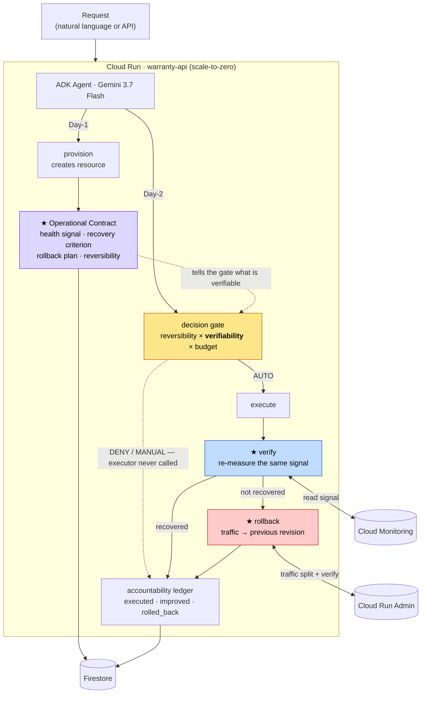
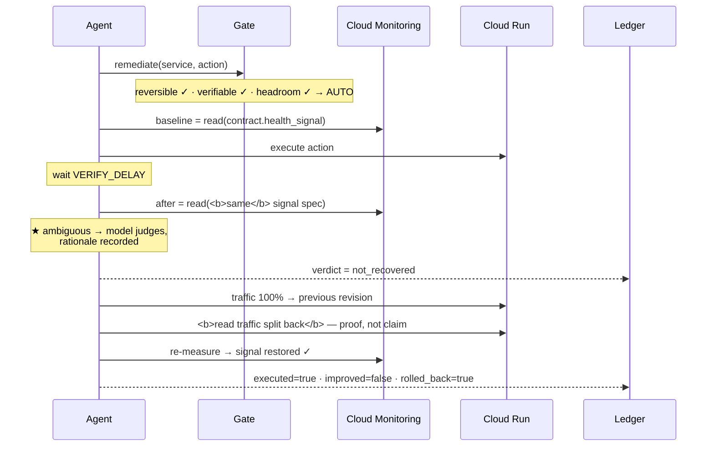
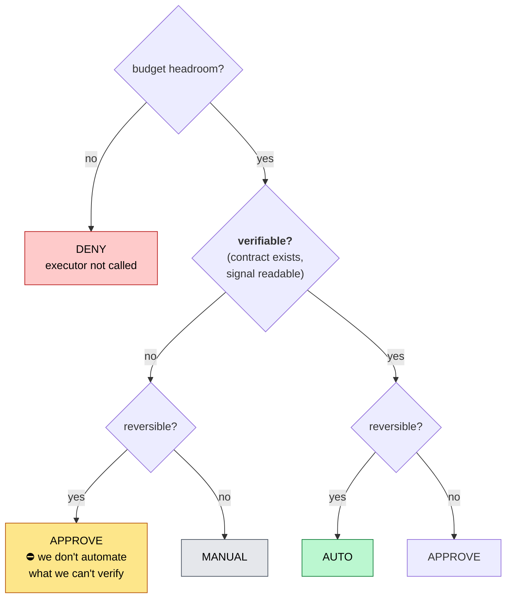
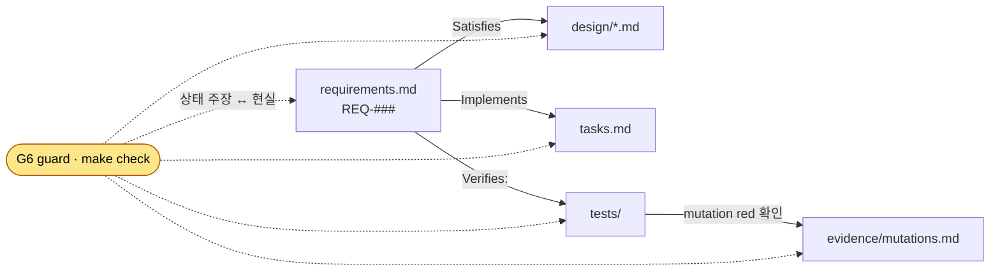

# warranty — 개요

> ▶ **NEXT SESSION: [`plans/2026-08-29-cost-axis.md`](plans/2026-08-29-cost-axis.md)의 C0 —
> Gemini 3.7 Flash 공시 단가를 출처와 함께 확보한다(사람 · 20분). 그게 없으면 아무것도 시작 못 한다.**
> ⛔ **논지의 세 다리 중 ③(조치당 비용)이 실물에서 전부 0이다** — 프로덕션 원장의 조치 항목
> 네 행이 `amount_usd = 0` · `attribution.method = none`. 기계는 다 있고 `VERIFIED`인데 값이 없다.
> ⭐ 헤드라인에 이미 `wasted_usd` 자리가 있다(`domain/report.py`) — **가장 강한 문장이
> 코드에 있는데 0이라 아무도 못 본다.** 그게 Flagger가 못 하는 자리다(`HACKATHON.md` §0).
> 오프라인은 끝났다(게이트 422 · 변이 264종). ⛔ **프로덕션은 아직 `00005-8x9`**이고,
> 그래서 대본(`submission/SCRIPT.md`)은 **안 건드렸다** — 대본이 안 도는 것을 말하게 둘 수 없다.
> ✅ **P0는 답이 났다 · 갈래 ⓒ 확정**: `warranty-hack`에 **L4 GPU 쿼터가 없다**
> (`evidence/gpu-quota-probe-2026-08-29.log` · 리소스 0개 생성, `validateOnly`로만 확인).
> ⇒ LLM 서빙 이동(ⓑ)은 죽었다. 아티클의 goodput 수치는 **재현이 아니라 문제 제기로만** 인용한다.
> ⭐ **조치가 둘이 됐다**(T2-5): 트래픽 전환 + **동시성 변경**. *"이거 Flagger 아니야?"*에
> 답이 생겼다 — 카나리 도구는 **배포할 때만** 움직이고 동시성은 아무 때나 바뀐다.
> ⚠️ 영상(T8-3)은 어느 갈래든 **남은 유일한 필수 산출물**이다. 대본 `submission/SCRIPT.md`.
> ✅ **Day-1·Day-2·리포트가 전부 공개 URL에서 실물이다**(`00005-8x9` · `27b61a6`) — 만들고
> 계약을 내고, 조치하고 되돌리고, `executed 1 · improved 0 · rolled_back 1`을 원장에서 낸다.
> ⚠️ **신호는 트래픽이 흐르는 동안에만 존재한다** — ⇒ **촬영은 부하를 켠 채로 한다.**
> ⭐ **실물 URL** (전부 `-povpqj6m5a-uc.a.run.app`): `warranty-api`(공개) ·
> `demo-target`(리비전 2개) · `day1-warranty-demo`·`day1-prod-demo`(에이전트가 만든 것 · IAM 비어 있음).
> ⚠️ 남은 `[auto]`·`.env` 부트스트랩은 [`tasks.md`](../specs/warranty/tasks.md)가 권위다.

> **인프라를 만든 에이전트가, 그것을 어떻게 고쳐야 하는지도 함께 적어 둔다.** 그리고 조치한 뒤
> **실제로 나아졌는지 다시 재고**, 안 나아졌으면 **원자적으로 되돌린다.**
> Google All Things Agentic Hackathon · Fortified Enterprise Fleet 트랙
> 작성 2026-08-19 · 상태: **설계 완료 · 구현 진행 중**

사람이 읽는 진입점이다. 요구사항 권위는 [`requirements.md`](../specs/warranty/requirements.md),
결정 근거는 [`design.md`](../specs/warranty/design.md). **이 문서는 그림과 서사를 소유한다.**

---

## 1. 문제

Remediation 에이전트는 조치를 실행하고 **성공을 보고한다.**
**실행 성공은 증상이 사라졌다는 뜻이 아니다.**

- 재시작했다 → 재시작은 성공했다 → **오류율은 그대로다**
- 스케일을 올렸다 → API가 200을 줬다 → **지연은 더 나빠졌다**
- 트래픽을 옮겼다 → 옮겨졌다 → **원인이 다른 곳이었다**

셋 다 **로그는 똑같이 초록이다.** 대부분의 도구는 그 차이를 말하지 못한다.

## 2. 왜 GCP 전용인가 — 이게 논지다

> **클라우드 중립성을 포기하면 에이전트가 무엇을 할 수 있게 되는가.**

중립적인 에이전트는 **모든 클라우드에서 표현 가능한 조치만** 할 수 있다.
그래서 실행하고 성공을 보고하지만 — 나아졌는지 증명하지 못하고, 원자적으로 되돌리지 못하고,
그 조치가 얼마 썼는지 말하지 못한다.

| 중립성이 막는 것 | GCP 올인이 여는 것 |
|---|---|
| 신호를 정규화하면 고유 정보가 깎인다 | **Cloud Monitoring을 그대로 읽는다** → 진짜 검증 |
| 되돌림이 점진적이면 자동 롤백을 못 믿는다 | **Cloud Run 트래픽 전환 = 원자적**, 배분으로 **증명** |
| 조치당 비용 귀속에 공통 수단이 없다 | **리소스 라벨이 결제 행에 실려 온다** |
| 자격증명이 전역이면 경계가 코드 필터다 | **테넌트별 SA + WIF** *(선택)* |

**대부분의 제출물은 멀티클라우드를 자랑으로 내건다. 이 프로젝트는 특화를 능력의 조건으로 내건다.**

## 3. 정책 한 줄

> ⛔ **검증할 수 없는 조치는 자동으로 실행하지 않는다.**
>
> 확인 못 하는 자동화는 자동화가 아니라 **방치**다.

## 4. 아키텍처



## 5. 조치 하나의 일생



**이 마지막 한 줄이 이 시스템이 말할 수 있고 대부분의 도구가 말할 수 없는 문장이다.**

## 6. 판정 게이트 — 축이 셋



⚠️ **검증 가능성이 축이라는 것이 이 프로젝트의 주장이다.** 되돌릴 수 있어도 나아졌는지
확인할 수 없으면 자동으로 하지 않는다.

## 7. 헤드라인 숫자

```
executed · improved · rolled_back · escalated · unverifiable · model_decided · wasted
```

대부분의 도구는 **`executed`만 세고 그것을 성공이라 부른다.** 이 표에 `improved`가 따로
있다는 것 하나가 논지다 — 그 칸이 `executed`보다 작을 수 있다고 인정하는 도구는 드물다.

⛔ **여기에 수를 적지 않는다.** 실제 값은 원장이 소유하고 `make report`가 센다. 예전에 이
자리에 `executed 41 · improved 23`이 있었는데 **어디서도 측정되지 않은 수**였다(T8-2).

## 8. 기술 스택 (대회 필수 요건)

| 요건 | 충족 |
|---|---|
| Gemini 3.5 이상 | **Gemini 3.7 Flash** (Vertex AI) |
| Google Agent Framework | **ADK** |
| Google Cloud 인프라 | **Cloud Run** + Firestore + Cloud Monitoring (+ BigQuery, 선택) |

⛔ GKE·상시 VM·Cloud SQL 안 씀 — 유휴 과금 0으로 수렴.

## 9. 이 저장소는 spec-driven이다



- 상태가 `IMPLEMENTED`면 → **테스트가 있어야 한다**
- 상태가 `VERIFIED`면 → **지워 보고 red를 확인한 변이 기록이 있어야 한다**
- 어긋나면 **`make check`가 red다**

## 10. 현재 상태

```
게이트    `make check` — 통과 수는 tasks.md 하단 한 곳에만 적는다
요구사항  44종 — 상태 분포는 `make trace`가 센다 (사람이 세어 적지 않는다)
추적성    ⭐ 남은 TODO는 선택 범위(WIF·테넌트 SA) 둘뿐이다. 못 묻는 절반은 안 주장한다
가드      G1~G9 변이 확인 → tasks.md「가드 현황」
변이      선언한 것 전부 red 확인 · 복구 후 초록 · 잔여 0 → docs/evidence/mutations.md
Day-1     ⭐ 공개 URL의 에이전트가 서비스를 만들고 계약을 함께 냈다(`day1-prod-demo`)
루프      ⭐ ADK가 기준선→조치→미회복→롤백→원장을 실물 GCP 어댑터로 완주(2026-08-28)
조치      ⭐ **둘이다** — 트래픽 전환 + 동시성 변경(`concurrency:N`). 롤백 코드는 안 늘었다
          ⛔ 동시성 조치는 **오프라인까지만 참이다**. 배포·실물 왕복은 아직 안 했다(T2-5)
ADK       ⭐ Gemini 3.7 Flash가 `remediate` 호출 · decision/verification/rollback 응답 확인
GCP       ⭐ Firestore Native 계약·원장·예산 + Monitoring p95 + Cloud Run 원자적 트래픽 전환
어댑터    `RunControl`·`SignalSource`·Firestore·실행자·예산을 `runtime.py` 한 곳에서 합성
README    재현 절차 + §4 아키텍처 직접 링크가 게이트를 지난다(T11-5 · T13-4)
응답      실물 ADK 최종 응답에 판정·검증·롤백 근거 노출. 직접 `/actions/*` 경로는 아직 501
서버      ⭐ 배포 `00005-8x9`(이미지 `27b61a6`)가 트래픽 100%. Day-1·Day-2·리포트 전부 실물
```

⚠️ **여기에 숫자를 세어 적지 않는다**(T0-6의 교훈) — 실제로 썩어 있었다: 이 상자가 말하던
`120 passed`·`VERIFIED 18`·`M-01~M-32`·`커밋 6개`는 **넷 다 틀렸다.** ⇒ 세는 자리는 하나다.

**다음**: **비용 축(C0 단가 확보 → wasted_usd 0 탈출) → 부하 켠 채 4분 영상 →
제출(09-01) → teardown(09-02).**
[`tasks.md`](../specs/warranty/tasks.md)가 권위다.

### 막혀 있는 것

| | 왜 | 잠그는 것 |
|---|---|---|
| 만든 서비스의 초대 권한 | 프로비저너가 IAM을 안 준다 — 조용히 전 세계에 열 수 없다 | 그 리소스의 신호를 밖에서 채우기(T3-5) |
| BQ 결제 내보내기 *(선택)* | 콘솔 수동 · 하루 지연 | REQ-506·509만 |

### ✅ 중단 기준 — **통과**

*"08-24까지 Cloud Run에서 도는 것이 없으면 접는다"* — **08-23에 배포됐다.**
증거 `docs/evidence/deploy-2026-08-23.log`.

### ⛔ 대신 새 시한이 박혔다

크레딧(Free Trial) **만료 2026-09-06**. 제출 09-01 · **teardown 09-02** 뒤 여유가 **4일뿐**이다.
⇒ T8-6(teardown 캘린더 등록)이 *"나중에 할 일"*에서 **날짜가 박힌 일**이 됐다.

## 11. 무엇을 하지 않는가

**멀티클라우드 어댑터** · 멀티테넌트 격리 티어 · 공급망/이미지 서명 · GitOps · 웹 대시보드 ·
런북 카탈로그 · 에스컬레이션 티어 · Model Armor.

⚠️ **멀티클라우드는 범위 밖이 아니라 논지의 반대편이다**(§2).

## 12. 알려진 한계 — 숨기지 않는다

- **인과가 아니라 상관이다.** 롤백 후 재측정은 약한 자연 실험이지 인과는 아니다.
- **계약은 프로비저닝을 거친 리소스만 갖는다.** 손으로 만든 것은 자동 대상이 아니다.
- **회복률은 "우리 기준으로" 회복률이다.** 계약의 판정 기준이 틀리면 검증도 틀린다.
- **공유 리소스의 비용 귀속은 못 푼다.** 한 조치 = 한 리소스일 때만 라벨 귀속을 쓴다.
- **신호는 트래픽이 흐르는 동안에만 있다.** scale-to-zero의 대가다(T8-1).

## 13. 용어

| 용어 | 뜻 |
|---|---|
| **운영 계약** | Day-1이 산출하는, 그 리소스를 어떻게 검증·롤백하는지의 선언 |
| **verifiable** | 계약이 살아 있고 신호를 지금 읽을 수 있는가. **판정 게이트의 축** |
| **improved** | 조치 후 신호가 계약 기준으로 회복됐는가. **`executed`와 다른 값** |
| **assumed / measured** | 계산한 비용 / 청구서가 말한 비용. **전자는 절대 안 덮는다** |
| **가역성** | 되돌릴 수 있는가. 승인 게이트의 축(severity가 아니다) |
