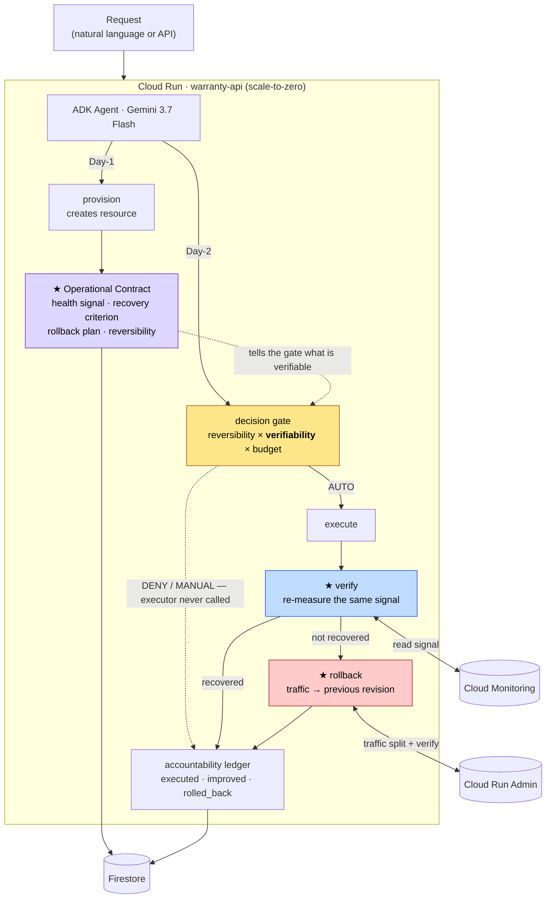
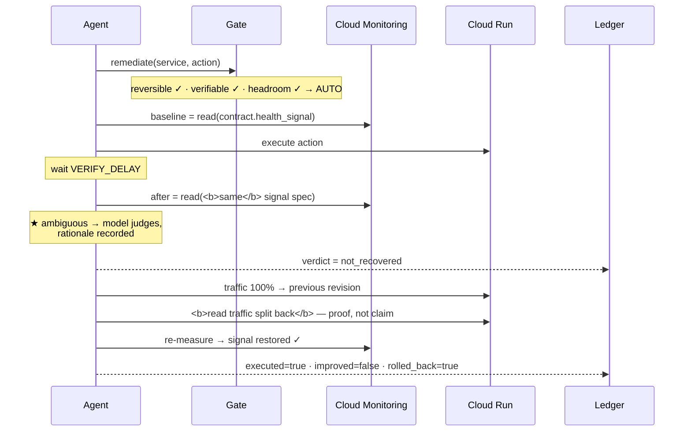
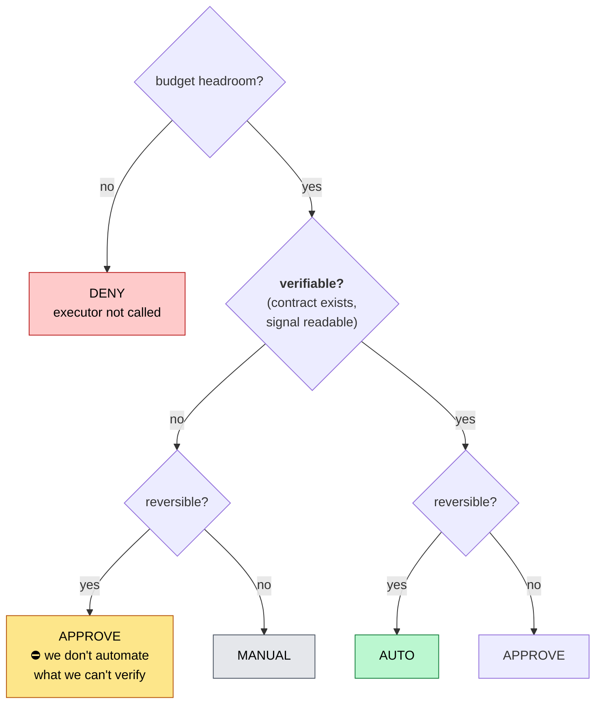

# warranty — 개요

> ▶ **NEXT SESSION: 첫 행동 = 변경분을 명시적으로 커밋한 뒤 `warranty-api`를 배포하고 인증된 `/agent:chat` 실물 호출을 확인한다.**
> ✅ ADK·Gemini→Monitoring→Cloud Run→Firestore 실물 왕복 완료 — AUTO·미회복·원자적 롤백,
> M-01~M-246 전부 red와 `make check` 392 passed를 확인했다.
> ⛔ **현재 배포 리비전은 이전 코드다.** 로컬 실물 배선은 끝났지만 공개 URL은 아직 유효 토큰에 501이다.
> ⭐ **실물 URL**: `https://warranty-api-povpqj6m5a-uc.a.run.app` (공개) · `https://demo-target-450305106907.us-central1.run.app` (리비전 2개).
> ⚠️ 남은 `[auto]`와 `.env`의 부트스트랩 `WR_PROJECT_ID`는
> [`tasks.md`](../specs/warranty/tasks.md)가 권위다 — **여기서 세지 않는다.**

> **인프라를 만든 에이전트가, 그것을 어떻게 고쳐야 하는지도 함께 적어 둔다.** 그리고 조치한 뒤
> **실제로 나아졌는지 다시 재고**, 안 나아졌으면 **원자적으로 되돌린다.**
> Google All Things Agentic Hackathon · Fortified Enterprise Fleet 트랙
> 작성 2026-08-19 · 상태: **설계 완료 · 구현 진행 중**

사람이 읽는 진입점이다. 요구사항 권위는 [`requirements.md`](../specs/warranty/requirements.md),
결정 근거는 [`design.md`](../specs/warranty/design.md). **이 문서는 그림과 서사를 소유한다.**

---

## 1. 문제

Remediation 에이전트는 조치를 실행하고 **성공을 보고한다.**
**실행 성공은 증상이 사라졌다는 뜻이 아니다.**

- 재시작했다 → 재시작은 성공했다 → **오류율은 그대로다**
- 스케일을 올렸다 → API가 200을 줬다 → **지연은 더 나빠졌다**
- 트래픽을 옮겼다 → 옮겨졌다 → **원인이 다른 곳이었다**

셋 다 **로그는 똑같이 초록이다.** 대부분의 도구는 그 차이를 말하지 못한다.

## 2. 왜 GCP 전용인가 — 이게 논지다

> **클라우드 중립성을 포기하면 에이전트가 무엇을 할 수 있게 되는가.**

중립적인 에이전트는 **모든 클라우드에서 표현 가능한 조치만** 할 수 있다.
그래서 실행하고 성공을 보고하지만 — 나아졌는지 증명하지 못하고, 원자적으로 되돌리지 못하고,
그 조치가 얼마 썼는지 말하지 못한다.

| 중립성이 막는 것 | GCP 올인이 여는 것 |
|---|---|
| 신호를 정규화하면 고유 정보가 깎인다 | **Cloud Monitoring을 그대로 읽는다** → 진짜 검증 |
| 되돌림이 점진적이면 자동 롤백을 못 믿는다 | **Cloud Run 트래픽 전환 = 원자적**, 배분으로 **증명** |
| 조치당 비용 귀속에 공통 수단이 없다 | **리소스 라벨이 결제 행에 실려 온다** |
| 자격증명이 전역이면 경계가 코드 필터다 | **테넌트별 SA + WIF** *(선택)* |

**대부분의 제출물은 멀티클라우드를 자랑으로 내건다. 이 프로젝트는 특화를 능력의 조건으로 내건다.**

## 3. 정책 한 줄

> ⛔ **검증할 수 없는 조치는 자동으로 실행하지 않는다.**
>
> 확인 못 하는 자동화는 자동화가 아니라 **방치**다.

## 4. 아키텍처



## 5. 조치 하나의 일생



**이 마지막 한 줄이 이 시스템이 말할 수 있고 대부분의 도구가 말할 수 없는 문장이다.**

## 6. 판정 게이트 — 축이 셋



⚠️ **검증 가능성이 축이라는 것이 이 프로젝트의 주장이다.** 되돌릴 수 있어도 나아졌는지
확인할 수 없으면 자동으로 하지 않는다.

## 7. 헤드라인 숫자

```
executed          41
improved          23   ←  56%      ★ 어떤 운영 에이전트도 안 내는 숫자
rolled back       12
escalated          6
unverifiable       3   ←  정직성 칸
model decided      5   ←  애매해서 모델이 판정한 건수
wasted            $0.84 ←  회복 실패 조치가 쓴 비용
```

대부분의 도구는 **`executed`만 세고 그것을 성공이라 부른다.**

## 8. 기술 스택 (대회 필수 요건)

| 요건 | 충족 |
|---|---|
| Gemini 3.5 이상 | **Gemini 3.7 Flash** (Vertex AI) |
| Google Agent Framework | **ADK** |
| Google Cloud 인프라 | **Cloud Run** + Firestore + Cloud Monitoring (+ BigQuery, 선택) |

⛔ GKE·상시 VM·Cloud SQL 안 씀 — 유휴 과금 0으로 수렴.

## 9. 이 저장소는 spec-driven이다


- 상태가 `IMPLEMENTED`면 → **테스트가 있어야 한다**
- 상태가 `VERIFIED`면 → **지워 보고 red를 확인한 변이 기록이 있어야 한다**
- 어긋나면 **`make check`가 red다**

## 10. 현재 상태

```
게이트    `make check` — 통과 수는 tasks.md 하단 한 곳에만 적는다
요구사항  44종 — 상태 분포는 `make trace`가 센다 (사람이 세어 적지 않는다)
가드      G1~G9 변이 확인 → tasks.md「가드 현황」
변이      선언한 것 전부 red 확인 · 복구 후 초록 · 잔여 0 → docs/evidence/mutations.md
루프      ⭐ ADK가 기준선→조치→미회복→롤백→원장을 실물 GCP 어댑터로 완주(2026-08-28)
ADK       ⭐ Gemini 3.7 Flash가 `remediate` 호출 · decision/verification/rollback 응답 확인
GCP       ⭐ Firestore Native 계약·원장·예산 + Monitoring p95 + Cloud Run 원자적 트래픽 전환
어댑터    `RunControl`·`SignalSource`·Firestore·실행자·예산을 `runtime.py` 한 곳에서 합성
README    재현 절차 + §4 아키텍처 직접 링크가 게이트를 지난다(T11-5 · T13-4)
응답      실물 ADK 최종 응답에 판정·검증·롤백 근거 노출. 직접 `/actions/*` 경로는 아직 501
서버      현재 배포 `00002-c6q`는 D15만 포함. 새 `/agent:chat` 배선은 다음 커밋·배포 대상
```

⚠️ **여기에 숫자를 세어 적지 않는다**(T0-6의 교훈) — 실제로 썩어 있었다: 이 상자가 말하던
`120 passed`·`VERIFIED 18`·`M-01~M-32`·`커밋 6개`는 **넷 다 틀렸다.** ⇒ 세는 자리는 하나다.

**다음**: **ADK usage 계량 → 명시적 커밋 → 재배포 → 인증된 `/agent:chat` 프로덕션 왕복.**
[`tasks.md`](../specs/warranty/tasks.md)가 권위다.

### 막혀 있는 것

| | 왜 | 잠그는 것 |
|---|---|---|
| **새 리비전 배포** | 배포 태그가 커밋 SHA라 미커밋 코드를 올릴 수 없다 | 프로덕션 `/agent:chat` 왕복 |
| BQ 결제 내보내기 *(선택)* | 콘솔 수동 · 하루 지연 | REQ-506·509만 |

### ✅ 중단 기준 — **통과**

*"08-24까지 Cloud Run에서 도는 것이 없으면 접는다"* — **08-23에 배포됐다.**
증거 `docs/evidence/deploy-2026-08-23.log`.

### ⛔ 대신 새 시한이 박혔다

크레딧(Free Trial) **만료 2026-09-06**. 제출 09-01 · **teardown 09-02** 뒤 여유가 **4일뿐**이다.
⇒ T8-6(teardown 캘린더 등록)이 *"나중에 할 일"*에서 **날짜가 박힌 일**이 됐다.

## 11. 무엇을 하지 않는가

**멀티클라우드 어댑터** · 멀티테넌트 격리 티어 · 공급망/이미지 서명 · GitOps · 웹 대시보드 ·
런북 카탈로그 · 에스컬레이션 티어 · Model Armor.

⚠️ **멀티클라우드는 범위 밖이 아니라 논지의 반대편이다**(§2).

## 12. 알려진 한계 — 숨기지 않는다

- **인과가 아니라 상관이다.** 롤백 후 재측정은 **약한 자연 실험**이지만 인과는 세우지 못한다.
- **계약은 프로비저닝을 거친 리소스만 갖는다.** 손으로 만든 리소스는 자동 대상이 아니다.
- **회복률은 "우리 기준으로" 회복률이다.** 계약의 판정 기준이 틀리면 검증도 틀린다.
- **공유 리소스의 비용 귀속은 못 푼다.** 한 조치 = 한 리소스인 경우에만 라벨 귀속을 쓴다.

## 13. 용어

| 용어 | 뜻 |
|---|---|
| **운영 계약** | Day-1이 산출하는, 그 리소스를 어떻게 검증·롤백하는지의 선언 |
| **verifiable** | 계약이 살아 있고 신호를 지금 읽을 수 있는가. **판정 게이트의 축** |
| **improved** | 조치 후 신호가 계약 기준으로 회복됐는가. **`executed`와 다른 값** |
| **assumed / measured** | 계산한 비용 / 청구서가 말한 비용. **전자는 절대 안 덮는다** |
| **가역성** | 되돌릴 수 있는가. 승인 게이트의 축(severity가 아니다) |
